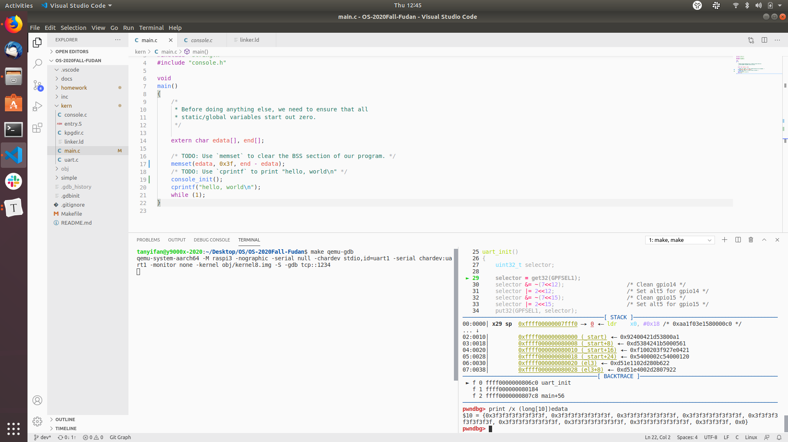
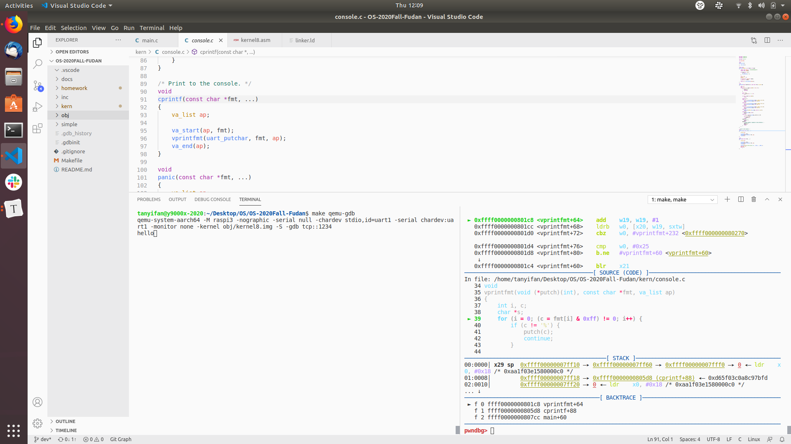
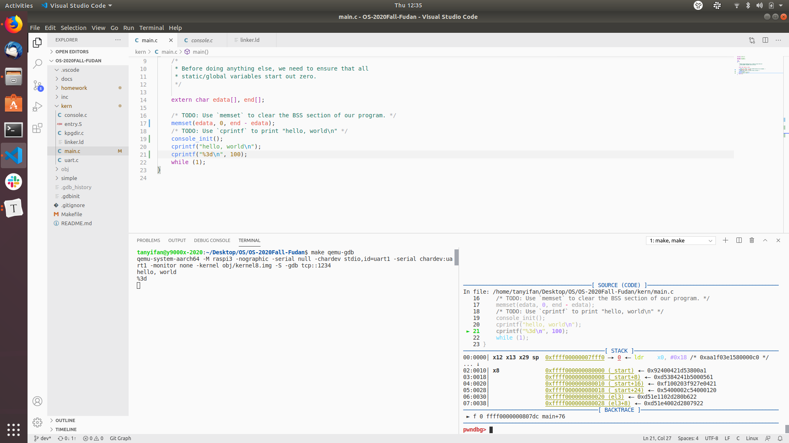

# Lab 1 Report

18307130024 Tan-YiFan

[TOC]


## 1. ARM Architecture

The reference of this part includes:

[Stanford](https://cs140e.sergio.bz/assignments/3-spawn)

[ARMv8 Reference Manual](https://cs140e.sergio.bz/docs/ARMv8-Reference-Manual.pdf)

### 1.1 Registers

#### 1.1.1 General Registers

The general registers of `ARMv8` architecture are listed below.

| Registers        | Description                 |
| ---------------- | --------------------------- |
| $X_0$ ~ $X_{30}$ | General purpose registers   |
| $PC$             | Program counter (read-only) |
| $XZR$            | Zero register (read-only)   |
| $SP$             | Stack pointer               |

The following table describes the common usage the general purpose registers $X_0$ ~ $X_{30}$.

| Registers           | Description                |
| ------------------- | -------------------------- |
| $X_0$ ~ $X_{7}$     | Arguments and return value |
| $X_8$ ~ $X_{18}$    | Temporary registers        |
| $X_{19}$ ~ $X_{28}$ | Callee-saved registers     |
| $X_{29}$            | Frame pointer              |
| $X_{30}$            | Link register              |

$W_0$ ~ $W_{30}$, $WZR$ alias the least-significant 32-bits of $X_0$ ~ $X_{30}$, $XZR$ respectively.

#### 1.1.2 Process State

In `ARMv8` architecture, process state or `PSTATE` is an abstraction of process state information. It contains several fields:

* Condition flags (4 bits). The fields are: **N**, negative condition flag; **Z**, zero condition flag; **C**, carry condition flag; **V**, overflow condition flag.
* Execution state control. This field contains `EL`, current exception level; and `SP`, stack pointer register selection bit.
* Exception mask bits. The fields are `DAIF`: **D**, debug exception mask bit; **A**, SError interrupt mask bit; **I**, IRQ interrupt mask bit; **F**, FIQ interrupt mask bit.
* Access control bits.
* Timing control bits.
* Speculation control bits.

To access these fields, using `mrs` or `msr` instructions and the following **system registers**:

* `NZCV`: 64-bits. Bits[31:28] are N, Z, C, V respectively; other bits are reserved as 0.
* `DAIF`: 64-bits. Bits[9:6] are D, A, I, F respectively; other bits are reserved as 0.
* `CurrentEL`: 64-bits. Bits[3:2] shows current exception level; other bits are reserved as 0.
* `SPSel`: 64-bits. Bits[0] shows which stack pointer to use: `0` means use `SP_EL0` at all exception levels; `1` means use `SP_ELx` for all exception level `ELx`. Other bits are reserved as 0.

#### 1.1.3 Registers for exception handling

Several system registers related to exception are duplicated for each exception level.

##### 1.1.3.1 Stack Pointer

When executing at EL0, the processor uses EL0 stack pointer.

When executing at any other exception level, the processor can be configured to use either EL0 stack pointer or the stack pointer for this exception level.

By default, taking an exception will select the stack pointer for target exception level. Updating the PSTATE.SP can switch the mode from target exception level to EL0 stack pointer.

##### 1.1.3.2 Saved Program Status Registers

The Saved Program Status Registers (`SPSRs`) are used to save program state on taking exceptions.

Since exceptions can not be taken to EL0, there are only `SPSR_EL1`, `SPSR_EL2`, `SPSR_EL3` without `SPSR_EL0`.

We will only use `AARCH64` state, so I'll focus on `SPSR` format on `AARCH64` state:

* Bits[31:28] shows the {N, Z, C, V}.
* Bits[9:6] shows the {D, A, I, F}.
* Bits[3:2] shows the exception level.
* Bits[0] shows the selection of the stack pointer.

##### 1.1.3.3 Exception Link Registers

Similarly, there are only `ELR_EL1`, `ELR_EL2`, `ELR_EL3` without `ELR_EL0`.

The `ELR` stores the PC of exception return address.

### 1.2 Instruction

`ARMv8` instruction set is a `RISC`. We've learned another `RISC`-`MIPS` instruction set. They look similar in some ways. 

The following table lists some commonly-used instructions of `ARMv8`.

| Instruction                | Operation                                             | Description                                                  |
| -------------------------- | ----------------------------------------------------- | ------------------------------------------------------------ |
| add/sub/orr/and dest, a, b | dest = a `op` b                                       | b can be imm or reg                                          |
| ldr/str ra, [rb, imm]      | load or save: <br>addr: *(rb + imm) <br>value: ra     |                                                              |
| ldr/str ra, [rb, imm]!     | In addition to the operation above, <br>rb = rb + imm |                                                              |
| ldp/stp ra, rb, [rc, imm]  |                                                       | load/store pair                                              |
| mov ra, imm1, LSL imm2     | ra = imm1 << imm2                                     |                                                              |
| movk ra, imm1, LSL imm2    |                                                       | `mov` without replacing other bits                           |
| msr/mrs                    |                                                       | move from/to special registers                               |
| b/bl label                 |                                                       | branch/branch and link                                       |
| br/blr ra                  |                                                       | branch to register/branch to register and link               |
| cmp + beq/bne/blt/...      |                                                       | compare and set the condition flags, then branch             |
| ldr ra, =label             |                                                       | Load the address of the label. The label is not within the same linker section. |
| adr ra, label              |                                                       | Load the address of the label. The label is within the same linker section. |

### 1.3 Exception

#### 1.3.1 Exception Level

Every moment, the processor runs on a certain exception level, which also determines the privilege. The four exception levels are:

* EL0(user)
* EL1(kernel)
* EL2(hypervisor)
* EL3(monitor)

The `ARMv8` CPU starts at EL3 to wake up the firmware. Next, it switches to EL2 and loads the kernel. Then, it goes to EL1 so the kernel can run on the suitable exception level. User applications and untrusted processes usually run on EL0.

#### 1.3.2 Switching Exception Level

##### 1.3.2.1 Low -> High 

The circumstance occurs only as a result of an exception.

When an exception to ELx(x = 1, 2, 3) occurs, the CPU does the following thing:

*  `PSTATE.DAIF <- {1, 1, 1, 1}`. This is to mask all exceptions and interrupts.
* `SPSR_ELx <- PSTATE`. This is to save the program state.
* `ELR_ELX <- PC`. This is to store the PC when the exception occurs.
* `if(SPSel) sp <- SP_ELx`.
* Jump to the exception handler.

##### 1.3.2.2 High -> Low

This operation is done by `eret` instruction.

On `eret` from ELx, the CPU does the following thing:

* `PC <- ELR_ELx`. This is to restore the PC.
* `PSTATE <- SPSR_ELx`. This is to restore the PSTATE.
* Set the sp.

## 2. Linker Scripts

The reference of this part includes:

[Linker Scripts](https://sourceware.org/binutils/docs/ld/Scripts.html)

I use `aarch64-linux-gnu-ld --verbose > homework/default_linker.ld` to view the default linker script and summarize some of the syntax of linker script.

### 2.1 ENTRY

```
ENTRY(_start)
```

Set the address of the first instruction to be executed.

The linker will check the following statement with priority:

* Check whether the user runs `ld` with `-e` option. If so, use the value from the command.
* If not, check whether the linker script has a `ENTRY()` line. If so, use the value within `ENTRY()`.
* If not, check whether `_start` is defined. If so, use `_start` as entry point.
* If not, check whether `.text` section exists. If so, use the first byte of `.text` as entry point.
* If not, use `0` as entry point.

### 2.2 Location Counter `.`

The `.` always contains the current output location counter.

Approaches to changing the value of `.` include:

* Assigning value to `.`, such as `. = 0x80000;` and `. = . + 0x200;`
* Through output section description, such as `PROVIDE(data = .); .data : { *(.data) }` which will move `.` to the end of `.data`.

### 2.3 PROVIDE

`PROVIDE` is used to define those symbols referenced in object files but not defined in any object files.

Example:

`PROVIDE (edata = .);`

We use two `PROVIDE` lines, one at the beginning of `.bss` section and one at the end of it, in order to identify the range of `.bss` section.

### 2.4 SECTIONS

```
The SECTIONS command tells the linker how to map input sections into output sections, and how to place the output sections in memory. 
```

Codes like `.rodata : { *(.rodata) }` means an output section `.rodata` whose range is `.rodata` of all input files. `*` means all and can be replaced with a file name if the section of a certain input file is needed.

## 3. Code of Lab1

### 3.1 Why not `b main`

The branch instruction requires the offset within the range from `-128MB` to `128MB`. The `main` function may be very far away from `_start`, so we should use `ldr` plus `br` instead of `b`.

I set the `kern/linker.ld` as below, adding two lines in front of `. = 0xFFFF000000080000;`:

```
SECTIONS
{
    . = 0xFFFF000020000000;
    .text0 : {*(.text.startup)}
    . = 0xFFFF000000080000;
    .text : {
        KEEP(*(.text.boot))
        *(.text)
    } 
    PROVIDE(etext = .);
    .rodata : { *(.rodata) }
    PROVIDE(data = .);
    .data : { *(.data) }
    PROVIDE(edata = .);
    .bss : { *(.bss) }
    PROVIDE(end = .);
}
```

Under `-O2` compilation option, the `main` function is in the `.text.startup` section.

I set `main` function near address `0xFFFF000020000000` so the offset is above the limit.

```
Disassembly of section .text0:

ffff000020000000 <main>:
```

I use `b main` in `_start` section which is near address `0xFFFF000000080000` and get the following code:

```asm
     * Jump to C code, should not return.
     * Why not directly run `b main`?
     */ 
    /* ldr     x1, =main
    br      x1 */
    b main
ffff0000000800ac:	1400000b 	b	ffff0000000800d8 <__main_veneer>

/* I skip some code here. */

ffff0000000800d8 <__main_veneer>:
ffff0000000800d8:	900ffc10 	adrp	x16, ffff000020000000 <main>
ffff0000000800dc:	91000210 	add	x16, x16, #0x0
ffff0000000800e0:	d61f0200 	br	x16
```

If the offset is beyond the limit, the complier and the linker use `br` to implement `b` instruction.

### 3.2 Exercise 1: Initialize the `bss` section

We have already got the range of the `bss` section: from `edate` to `end`; more precisely, [`edata`, `end`).

Therefore, one line of `memset(edata, 0, end - edata);` is enough.

To check whether the code works, change the `0` to `0x3f` to make those bits distinct for more smooth debug.



### 3.3 Exercise 2: Initialize the Console and Print "Hello World"

`console_init();` and `cprintf("hello, world\n");` can work.

`cprintf()` calls `vprintfmt()`. `vprintfmt()` deals with the formated string and calls `putch()` and `printint()` to print information to the console.

Using `gdb`, I review and capture the procedure of printing every single character:



Currently, `vprintfmt` cannot deal with outputs with specified width. For example, the action of `cprintf("%3d\n", 100);` is different from `printf("%3d\n", 100);`.



I may implement this feature in the future.